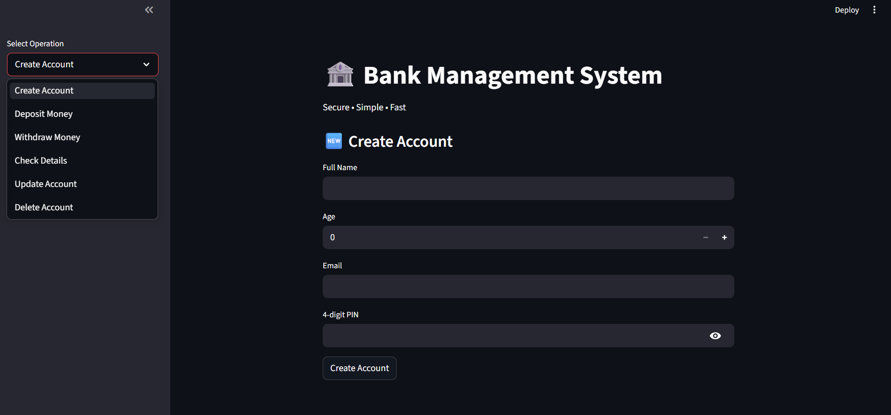

# 🏦 Bank Management System

A beginner Python project built while learning OOP, file handling, and Streamlit.

---

## 💡 Why I Built This

I'm a Full Stack Developer (MERN) transitioning into **AI Engineering**.  
To get there, I started learning Python properly — not just tutorials, but by actually building something.  
This is my first real Python project, built completely from scratch.

---

## ✨ Features

- 🆕 **Create Account** — name, age, email, 4-digit PIN, auto-generated 10-digit account number
- 💰 **Deposit Money** — with amount validation
- 🏧 **Withdraw Money** — with balance check
- 📄 **Check Account Details** — view all stored account info
- ✏️ **Update Account** — change name, email or PIN
- 🗑️ **Delete Account** — remove account permanently
- 💾 **Persistent Storage** — all data saved in a JSON file, no database needed

---

## 🛠️ Tech Stack

| Tool | Purpose |
|------|---------|
| Python | Core logic |
| OOP (Classes & Methods) | Code structure |
| JSON + File I/O | Data storage |
| Streamlit | Web UI |

---

## 📁 Project Structure

```
bank-management-system/
│
├── main.py          # Bank class — all core logic
├── app.py           # Streamlit web UI
├── requirements.txt # Project dependencies
├── .gitignore       # Files to ignore (data.json, cache)
└── README.md        # You are here
```

---

## 🚀 How to Run Locally

**1. Clone the repository**
```bash
git clone https://github.com/vishalvermacore/Bank-Management-System.git
cd Bank-Management-System
```

**2. Install dependencies**
```bash
pip install -r requirements.txt
```

**3. Run the app**
```bash
streamlit run app.py
```

**4. Open in browser**
```
http://localhost:8501
```

---

## 📸 Screenshot



---

## 🔍 How It Works

- All logic lives inside the `Bank` class in `main.py`
- Streamlit (`app.py`) handles the UI and calls methods from `Bank`
- Account data is stored in `data.json` which is auto-created on first run
- Each account has: name, age, email, PIN, account number, balance
- Private methods handle account search, data update, and account number generation

---

## 📌 What I Learned

- How to structure a project using OOP in Python
- How file handling works and why databases exist
- How to build a simple web UI using Streamlit
- Input validation and error handling in real code

---

## 🗺️ What's Next

This is just the beginning. My learning path:

```
Python Basics ✅ → OOP + File Handling ✅ → Backend APIs → ML Fundamentals → AI Engineering 🎯
```

---

## 👨‍💻 About Me

**Vishal Verma** — Full Stack Developer transitioning into AI Engineering  
📍 Muzaffarnagar, Uttar Pradesh, India  
🔗 [LinkedIn](https://linkedin.com/in/vishalvermacore)  


---

> *"I'm not trying to build the most complex project. I'm trying to understand every line I write."*
